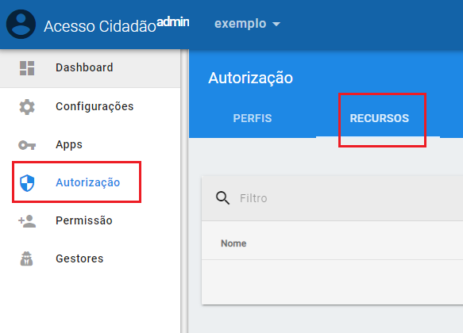
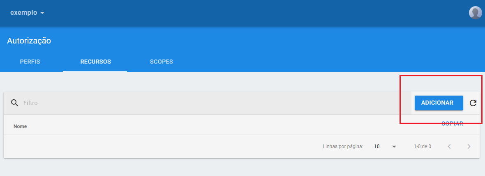
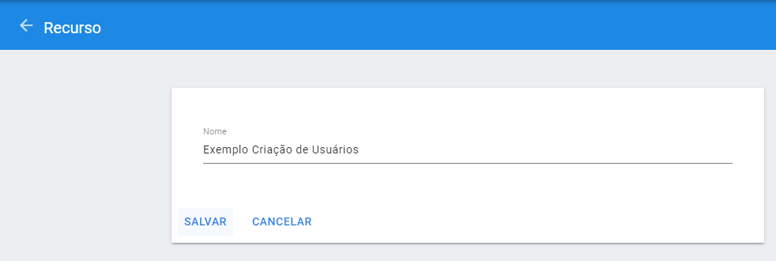
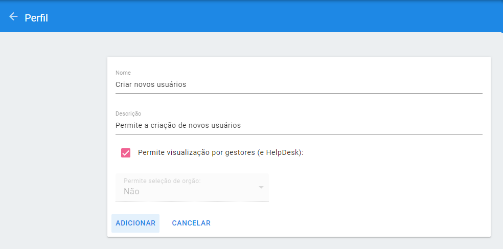
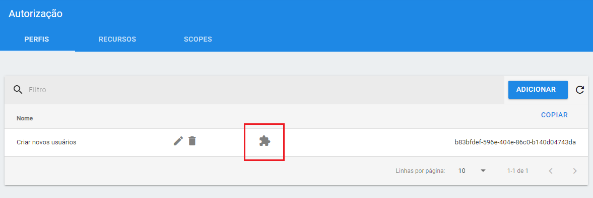
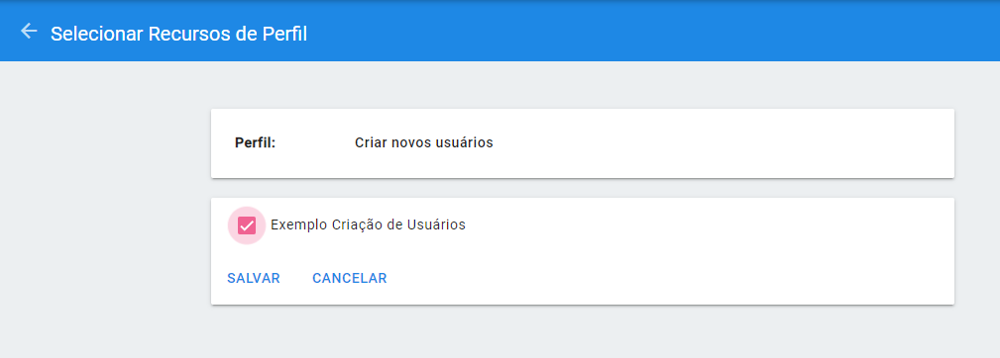
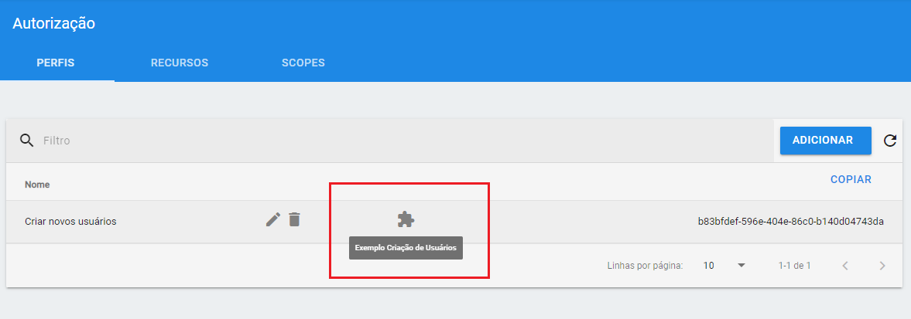

# Autorizações no Acesso Cidadão

O esquema de autorizações do Acesso Cidadão envolve a criação de perfis e recursos e suas atribuições aos variados tipos de funções que 
os agentes públicos podem desempenhar em um sistema.  

O Acesso Cidadão permite apenas a especificação de um recursos e sua posterior atribuição a um perfil. O funcionamento desse recurso é 
atribuição do sistema em si é feito pelo desenvolvedor, durante a escrita do código.  
No Acesso Cidadão esse conjunto **```Recurso + Perfil```** poderá ser gerenciado de maneira mais dinâmica, sendo possível víncular agentes 
públicos à funções específicas do sistema, bem como o gerenciamento dessas funções e das prerrogativas de cada agente público (ou um 
grupo de agentes) em diferentes conjuntos de responsabilidades.

## Recursos e Perfis

***<span style="font-size: 18px">Recurso</span>*** é a funcionalidade a ser desempenhada pelo sistema. Como essa funcionalidade deve de 
fato "funcionar" é escrita pelo desenvolvedor do sistema. No Acesso Cidadão cria-se uma referência para essa funcionalidade, que posteriormente 
será atribuída a um **Perfil**.  
É esse par que, em um próximo passo, será vinculada a uma entidade conhecida como **<span style="color: red">Permissão</span>**.  

***<span style="font-size: 18px">Perfil</span>*** é a abstração de quem pode ter a prerrogatiza de usar o **Recurso**. Só depois de um recurso 
ser atribuído a um perfil é que de fato pode-se conceder uma **<span style="color: red">Permissão</span>** dentro de um sistema.

### Criação de Recursos e Perfis

1 - Após encontrar seu sistema no Acesso Cidadão Admin clique em **Autorização**, escolha a aba ***Recursos*** e clique em adicionar.
  


&nbsp;  

2 - Dê um nome para o recursos. Use como referência a funcionalidade do sistema. Clique em Salvar.

&nbsp;  

3 - O recurso será exibido na tela. 
  

Clique na aba **Perfis**, e em seguida clique em Adicionar.

&nbsp;  

4 - Atribua um nome ao Perfil e adicione uma descrição e em seguida clique em adicionar.

&nbsp;  

5 - O novo perfil será exibido. Clique no ícone de quebra-cabeças para vincular um recursos.
  

Selecione o recurso que deseja vincular e clique em salvar.
  

A tela com a lista de perfis será exibida novamente. Ao passar o cursor sobre o ícone de quebra-cabeças o recurso deste perfil será exibido.


&nbsp;  

## Gestores

Dentro do Acesso Cidadão há diversas funções que um agente público pode desempenhar em um sistema. Embora sejam semelhantes, cada uma tem uma limitação
dentro daquilo que pode desempenhar.

### Proprietário

XXXX

### Desenvolvedor

XXXX  

### Gestor

Responsável por definir quem são os agentes públicos podem conceder autrizações dentro de um sistema.  

### Conceder Permissão

É quem concede as autorizações de um recurso específico para um agente público.