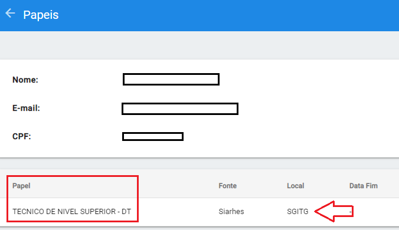
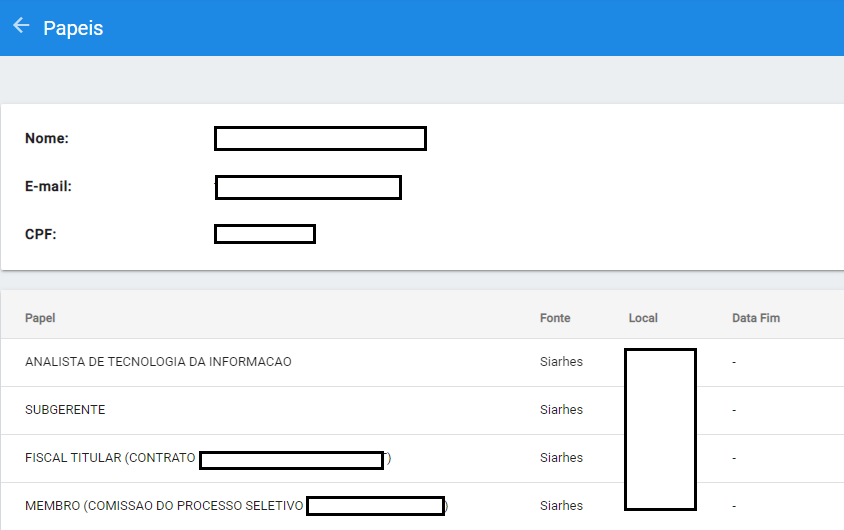

# Papéis

Um papel é definido pelo cargo e/ou função ocupado(a) pelo agente público, atrelado(a), necessariamente, ao local onde ele está lotado. Esse papel é atribuído 
pelo vínculo entre o agente público e o Governo do Estado, sendo assim sua origem é o <em>**SIARHES - Sistema Integrado de Administração de Recursos Humanos 
do Espírito Santo**</em>, ou outro sistema de RH caso seja de outra esfera de poder.
&nbsp;

Os papéis criados para fins de organização dos próprios órgãos ou entes administrativos são definidos por outros agentes públicos, sendo essa fonte 
denominada <em>**manual**</em>.
  
&nbsp;

Em caso de mudança de cargo, função ou de lotação, o papel antes ocupado pelo agente é "encerrado" e um novo papel é atribuído. Nesse caso todas as permissões
do papel anterior são removidas.
&nbsp;

É possível também o acúmulo de novos papéis, em caso de trabalhos em comissões, cargos comissionados, atribuições em contratos, etc. Ou também na possibilidade 
onde o ingresso se dá por mais de um concurso, como professores e profissionais da saúde. 

&nbsp;  

## Tipos de papéis

- ***Servidor***: é o tipo de papel que se origina a partir do início do exercício do agente público; tem como fonte, portanto, a sua inserção nos sistemas de RH. 
Enquanto o agente público estiver neste papel, sua validade permanece.  

- ***Comissão e Contrato***: são papéis que se originam da necessidade de se comporem comissões específicas para atividades que não são finalísticas do órgão, 
ou são multidisciplinares. Por exemplo: processos seletivos, composição de conselhos, fiscalização de contratos, etc. Também são originados da carga dos sistemas de RH.  

- ***Manual***: é aquele criado por iniciativa de outro agente público. São papéis criados com duração determinada e que se aplicam a atuações específicas dentro da 
organização ou sistema em que são criados. Só devem ser criados caso nenhum dos outros tipos sejam possíveis. Normalmente são usados para definir papéis de agentes 
públicos que não estão inseridos nos sistemas de RH, por exemplo, terceirizados  
&nbsp;  
&nbsp; 